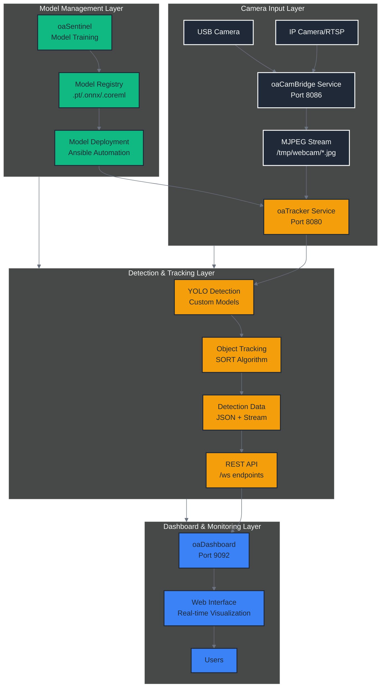
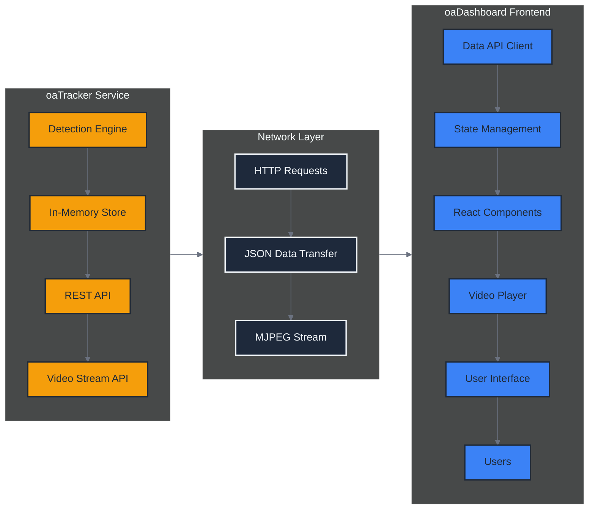
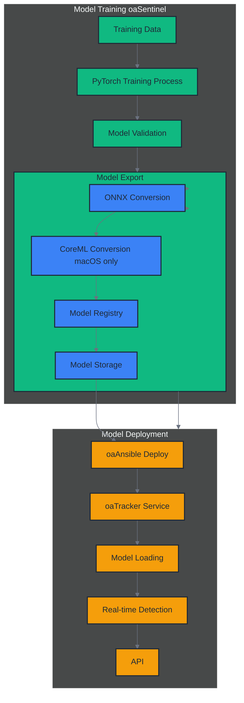
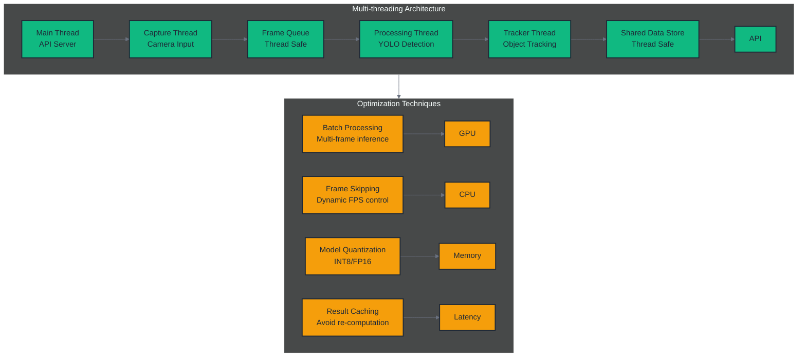

# oaTracker Integration Guide

## Overview

oaTracker is a real-time human detection and tracking service designed for seamless integration with the OrangeAd ecosystem. This guide covers integration patterns with oaCamBridge for camera input, oaDashboard for data consumption, and model deployment from oaSentinel.

## System Integration Architecture



## oaCamBridge Integration

### Integration Benefits

Using oaCamBridge as the camera input source provides several advantages:

1. **Decoupled Camera Permissions**: oaCamBridge handles macOS camera permissions centrally
2. **Frame Buffering**: Built-in frame caching and buffering for reliability
3. **Independent Restarts**: Camera service and tracker can restart independently
4. **Multiple Consumers**: Multiple services can consume the same camera feed
5. **Fallback Support**: Automatic camera reconnection and error handling

### Configuration Options

#### Option 1: HTTP MJPEG Stream (Recommended)

```yaml
# oaTracker/config.yaml
camera:
  uuid: "default-camera-001"
  source: "http://localhost:8086/stream"  # oaCamBridge MJPEG endpoint
  loop: false

detection:
  model: "models/sentinel_v1.0.onnx"  # Custom model from oaSentinel
  confidence: 0.5
  classes: [0]  # Person detection only

api:
  host: "0.0.0.0"
  port: 8080
```

#### Option 2: Frame Directory Input

```yaml
# oaTracker/config.yaml
camera:
  uuid: "default-camera-001"
  source: "/tmp/webcam/img_*.jpg"  # oaCamBridge frame directory
  loop: false

# Detection and API configuration...
```

#### Option 3: Direct Camera (Fallback)

```yaml
# oaTracker/config.yaml
camera:
  uuid: "default-camera-001"
  source: "0"  # Direct USB camera (fallback option)
  loop: false
```

### oaCamBridge Service Dependencies

```bash
# Start oaCamBridge first
cd ../oaCamBridge
./scripts/start.sh

# Verify oaCamBridge is running
curl http://localhost:8086/health

# Then start oaTracker
cd ../oaTracker
./scripts/start.sh

# Verify integration
curl http://localhost:8080/api/camera/status
```

### Service Orchestration

```yaml
# oaAnsible playbook excerpt for service startup order
- name: Start oaCamBridge service
  systemd:
    name: oacambridge
    state: started
    enabled: yes

- name: Wait for oaCamBridge to be ready
  uri:
    url: "http://localhost:8086/health"
    method: GET
  register: result
  until: result.status == 200
  retries: 10
  delay: 5

- name: Start oaTracker service
  systemd:
    name: oatracker
    state: started
    enabled: yes
```

## oaDashboard Integration

### API Data Consumption

oaDashboard consumes detection data from oaTracker through several API endpoints:

#### 1. Real-time Statistics

```javascript
// oaDashboard frontend integration
const fetchTrackerStats = async () => {
  const response = await fetch('http://localhost:8080/api/stats');
  const stats = await response.json();

  return {
    totalDetections: stats.total_detections,
    uniqueObjects: stats.unique_objects,
    fps: stats.fps,
    uptime: stats.uptime_seconds
  };
};
```

#### 2. Time-based Detection Counts

```javascript
// Get unique person count for last 30 seconds
const fetchRecentDetections = async (seconds = 30) => {
  const response = await fetch(`http://localhost:8080/api/detections?seconds=${seconds}`);
  const data = await response.json();

  return {
    uniqueCount: data.unique_count,
    timeRange: data.time_range_seconds,
    timestamp: new Date().toISOString()
  };
};
```

#### 3. Current Tracked Objects

```javascript
// Get all currently tracked objects with positions
const fetchTrackedObjects = async () => {
  const response = await fetch('http://localhost:8080/api/tracked_objects');
  const objects = await response.json();

  return objects.map(obj => ({
    id: obj.id,
    class: obj.class,
    confidence: obj.confidence,
    bbox: obj.bbox,
    lastSeen: obj.last_seen,
    trackAge: obj.track_age
  }));
};
```

#### 4. Video Stream Integration

```javascript
// Embed MJPEG video stream in dashboard
const VideoStream = () => {
  return (
    
  );
};
```

### WebSocket Integration (Planned)

```javascript
// Real-time updates via WebSocket (future enhancement)
const ws = new WebSocket('ws://localhost:8080/ws/detections');

ws.onmessage = (event) => {
  const detection = JSON.parse(event.data);

  // Update dashboard in real-time
  updateDetectionCount(detection.unique_count);
  updateTrackedObjects(detection.objects);
  updateVideoOverlay(detection.bboxes);
};
```

### Dashboard Data Flow



## Model Deployment and Configuration

### Model Integration with oaSentinel

oaTracker supports multiple model formats from oaSentinel:

#### 1. PyTorch Models (.pt)

```yaml
# oaTracker/config.yaml
detection:
  model: "models/sentinel_v1.0.pt"  # PyTorch format
  confidence: 0.6
  classes: [0]  # Person class only
```

#### 2. ONNX Models (.onnx) - Cross-platform

```yaml
detection:
  model: "models/sentinel_v1.0.onnx"  # ONNX format
  confidence: 0.6
  classes: [0]
```

#### 3. CoreML Models (.coreml) - macOS Optimized

```yaml
detection:
  model: "models/sentinel_v1.0.coreml"  # CoreML for M1/M2
  confidence: 0.6
  classes: [0]
```

### Model Deployment Workflow



### Model Performance Optimization

#### Hardware Acceleration

```python
# Automatic hardware detection in oaTracker
import torch

# Device selection logic
device = (
    0 if torch.cuda.is_available()  # NVIDIA GPU
    else "mps" if torch.backends.mps.is_available()  # Apple Silicon
    else "cpu"  # CPU fallback
)

# Model loading with device optimization
model = YOLO("models/sentinel_v1.0.pt")
model.to(device)
```

#### Model Size vs Performance Trade-offs

```yaml
# Model configuration options
detection:
  # Fast option - Good for real-time
  model: "models/yolov8n.pt"  # Nano - 6MB, 30+ FPS
  confidence: 0.5

  # Balanced option
  model: "models/sentinel_v1.0.onnx"  # Custom - 20MB, 20-25 FPS
  confidence: 0.6

  # Accurate option - For batch processing
  model: "models/yolov8m.pt"  # Medium - 50MB, 10-15 FPS
  confidence: 0.7
```

## Performance Optimization Patterns

### Multi-threading Architecture



### Resource Management

#### Configuration-based Resource Control

```yaml
# oaTracker/config.yaml - Performance tuning
camera:
  # Resolution control for performance
  width: 1280   # Reduce from 1920 for better FPS
  height: 720   # Reduce from 1080 for better FPS

detection:
  # Confidence threshold to reduce false positives
  confidence: 0.6  # Higher = fewer detections, less processing

  # FPS limiting to control resource usage
  max_fps: 25     # Limit maximum FPS

  # Processing optimization
  batch_size: 1   # Batch size for inference
  half_precision: true  # Use FP16 for faster inference

processing:
  # Thread pool sizing
  capture_threads: 1
  processing_threads: 2
  tracking_threads: 1

  # Memory management
  frame_buffer_size: 10  # Maximum frames in buffer
  track_history_size: 100  # Maximum track history
```

#### Monitoring and Health Checks

```yaml
# Health check endpoints for monitoring
GET /health
Response: {
  "status": "healthy",
  "camera": "connected",
  "model": "loaded",
  "fps": 28.5,
  "memory_usage": "1.2GB",
  "cpu_usage": "35%",
  "uptime_seconds": 3600
}

GET /api/camera/status
Response: {
  "connected": true,
  "resolution": [1280, 720],
  "fps": 30.0,
  "source": "http://localhost:8086/stream"
}
```

## Service Discovery and Registration

### Zero-Configuration Integration

```yaml
# Environment-based service discovery
services:
  oatracker:
    host: "0.0.0.0"
    port: 8080
    register_with_dashboard: true

  oacambridge:
    host: "localhost"
    port: 8086
    auto_discover: true

  oadashboard:
    host: "localhost"
    port: 9092
    health_check_interval: 30  # seconds
```

### Service Health Monitoring

```bash
# Service dependency health check script
#!/bin/bash

check_service_health() {
    local service_url=$1
    local service_name=$2

    if curl -f -s "$service_url/health" > /dev/null; then
        echo "✅ $service_name is healthy"
        return 0
    else
        echo "❌ $service_name is unhealthy"
        return 1
    fi
}

# Check service dependencies
check_service_health "http://localhost:8086" "oaCamBridge"
check_service_health "http://localhost:8080" "oaTracker"
check_service_health "http://localhost:9092" "oaDashboard"
```

## Error Handling and Recovery

### Integration Error Scenarios

#### 1. Camera Service Unavailable

```python
# oaTracker camera error handling
class CameraManager:
    def __init__(self, source):
        self.source = source
        self.reconnect_attempts = 0
        self.max_reconnect_attempts = 5

    def connect(self):
        try:
            # Try to connect to camera source
            if self.source.startswith("http"):
                # oaCamBridge integration
                response = requests.get(f"{self.source}/health", timeout=5)
                if response.status_code != 200:
                    raise ConnectionError("oaCamBridge not responding")

            self.camera = cv2.VideoCapture(self.source)
            if not self.camera.isOpened():
                raise ConnectionError("Camera not available")

            self.reconnect_attempts = 0
            return True

        except Exception as e:
            self.reconnect_attempts += 1
            if self.reconnect_attempts < self.max_reconnect_attempts:
                time.sleep(2 ** self.reconnect_attempts)  # Exponential backoff
                return self.connect()
            else:
                raise e
```

#### 2. Model Loading Failures

```python
# Fallback model loading
def load_model_with_fallback(model_path):
    try:
        # Try to load specified model
        model = YOLO(model_path)
        return model
    except Exception as e:
        logging.warning(f"Failed to load {model_path}: {e}")

        # Fallback to default model
        try:
            default_model = YOLO("yolov8n.pt")
            logging.info("Using default YOLOv8n model")
            return default_model
        except Exception as fallback_error:
            logging.error(f"Failed to load fallback model: {fallback_error}")
            raise
```

#### 3. API Service Degradation

```yaml
# Graceful degradation configuration
api:
  enable_health_checks: true
  enable_metrics: true
  enable_video_stream: true

  # Disable non-critical features under load
  auto_degrade:
    cpu_threshold: 80  # Disable video stream if CPU > 80%
    memory_threshold: 85  # Disable metrics if memory > 85%
    response_time_threshold: 1000  # ms
```

## Security Considerations

### Network Security

```yaml
# Secure API configuration
api:
  host: "127.0.0.1"  # Localhost only for production
  port: 8080
  cors_origins: ["http://localhost:9092"]  # Only dashboard domain

  # Authentication (optional)
  auth_required: false
  api_key_header: "X-API-Key"

  # Rate limiting
  rate_limit:
    requests_per_minute: 1000
    burst_size: 100
```

### Camera Privacy

```yaml
# Privacy and security settings
camera:
  # Disable camera recording
  recording_enabled: false

  # Frame retention
  frame_retention_seconds: 0  # Don't store frames

  # Privacy zones (mask sensitive areas)
  privacy_zones: [
    {"coordinates": [[0, 0], [100, 0], [100, 100], [0, 100]], "blur": true}
  ]
```

## Testing Integration

### Integration Testing Framework

```python
# Integration tests for service connectivity
import pytest
import requests

class TestServiceIntegration:
    def test_oacambridge_health(self):
        """Test oaCamBridge service health"""
        response = requests.get("http://localhost:8086/health")
        assert response.status_code == 200

    def test_oatracker_health(self):
        """Test oaTracker service health"""
        response = requests.get("http://localhost:8080/health")
        assert response.status_code == 200

    def test_detection_api(self):
        """Test detection API endpoints"""
        response = requests.get("http://localhost:8080/api/stats")
        assert response.status_code == 200

        data = response.json()
        assert "fps" in data
        assert "total_detections" in data

    def test_video_stream(self):
        """Test video stream availability"""
        response = requests.get("http://localhost:8080/video_feed", stream=True)
        assert response.status_code == 200
        assert "multipart/x-mixed-replace" in response.headers.get("content-type", "")
```

### Load Testing

```bash
# Performance testing script
#!/bin/bash

# Test API endpoint performance
ab -n 1000 -c 10 http://localhost:8080/api/stats

# Test video stream performance
ffmpeg -i http://localhost:8080/video_feed -f null - 2>&1 | grep "frame="
```

This integration guide provides comprehensive patterns for integrating oaTracker with the OrangeAd ecosystem, focusing on robust camera input via oaCamBridge, efficient data consumption by oaDashboard, and flexible model deployment from oaSentinel.