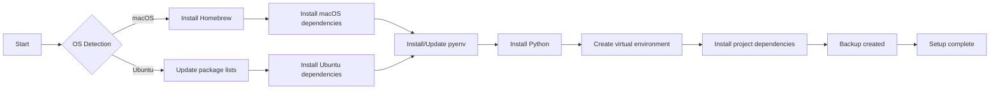

# oaTracker

## Overview

oaTracker is an internal application for MacOS and Ubuntu that utilizes Ultralytics and OpenCV for real-time video processing. It supports video feeds from USB cameras, RTSP streams, and video files, providing a simple HTTP API for detection retrieval.

## Features

- **Real-time Object Detection**: Uses YOLO models for efficient object detection.
- **Object Tracking**: Tracks individual objects across video frames.
- **Unique Object Counting**: Counts unique objects detected within a specified time range.
- **Time-based Queries**: Query detections within the last X seconds (1 <= X <= 30).
- **Multiple Video Sources**: Supports USB cameras, RTSP streams, and video files.
- **HTTP API**: Simple API for retrieving detection data with CORS support.
- **Configurable Settings**: Easy configuration via `config.yaml` file.
- **Structured Logging**: Comprehensive logging system for debugging and monitoring.
- **Video Looping**: Option to loop video file inputs for continuous processing.
- **Flexible Logging Options**: Control log output and log level via command-line arguments.
- **Safe Setup Process**: Improved setup script with robust backup, restore, and dry-run options.

## Getting Started

### Prerequisites

- macOS or Ubuntu
- Xcode (for macOS)
- Git

### Setup Process Visualization



### Setup

1. Clone the repository:

   ```sh
   git clone <repository-url>
   cd oaTracker
   ```

2. Run the setup script:

   ```sh
   ./setup.sh
   ```

   The setup script has several options:

   - `--clean` or `-c`: Clean up previous installations before setup
   - `--pyenv <option>` or `-p <option>`: Specify pyenv installation option:
     - `skip`: Skip pyenv installation/update (default)
     - `update`: Update existing pyenv installation
     - `force`: Force a fresh pyenv installation
   - `--force`: Equivalent to `--pyenv force`
   - `--dry-run`: Perform a dry run without making any changes
   - `--no-backup`: Skip creating a backup before making changes
   - `--restore <backup_dir>`: Restore from a specific backup directory

   Examples:

   ```sh
   ./setup.sh --clean                    # Clean up and run setup
   ./setup.sh --pyenv update             # Update existing pyenv and run setup
   ./setup.sh --force                    # Force fresh pyenv installation and run setup
   ./setup.sh --clean --force            # Clean up, force fresh pyenv installation, and run setup
   ./setup.sh --dry-run                  # Perform a dry run without making changes
   ./setup.sh --no-backup                # Skip creating a backup before setup
   ./setup.sh --restore /path/to/backup  # Restore from a specific backup
   ```

   The setup script includes the following safety features:

   - Creates a backup of only the files and folders that will be modified by the script
   - Stores the backup outside of the project directory to avoid conflicts
   - Provides a dry-run option for testing without making changes
   - Improves error handling and rollback mechanisms
   - Enhances shell detection and configuration for bash, zsh, and fish
   - Implements safeguards for critical system directories
   - Provides detailed logging with creation of log files for each run
   - Avoids duplicate entries when configuring pyenv in shell configuration files

3. Activate the virtual environment:

   For bash/zsh:

   ```sh
   source .venv/bin/activate
   ```

   For fish shell:

   ```sh
   source .venv/bin/activate.fish
   ```

### OS-Specific Considerations

#### macOS

- The script will install Homebrew if it's not already installed.
- macOS-specific dependencies are installed using Homebrew.
- The `pyobjc` package is installed for macOS-specific functionality.

#### Ubuntu

- The script updates package lists and installs necessary build dependencies.
- Ubuntu-specific packages are installed using `apt-get`.

### Shell-Specific Considerations

The script detects and supports the following shells:

- Bash
- Zsh
- Fish

Shell configuration files (`.bashrc`, `.zshrc`, `config.fish`) are updated accordingly to include pyenv configuration.

### Backup and Restore

- A backup is automatically created before making changes (unless `--no-backup` is used).
- The backup is stored in `$HOME/.oatracker_setup_backup_<timestamp>`.
- To restore from a backup, use:

  ```sh
  ./setup.sh --restore /path/to/backup
  ```

### Configuration

Modify `config.yaml` in the root directory to change default settings:

```yaml
default_camera: 0
default_model: "yolov10n.pt"
default_server_port: 8000

cors:
  allowed_origins:
    - "http://localhost:5173"
  allowed_methods:
    - "GET"
    - "OPTIONS"
  allowed_headers:
    - "Content-Type"
```

## Usage

Run the tracker using:

```sh
./tracker.py [OPTIONS]
```

### Command-line Options

- `--listCameras`, `-l`: List available cameras.
- `--camera`, `-c`: Select a camera (default in config.yaml).
- `--model`, `-m`: Specify the model file (default in config.yaml).
- `--serverPort`, `-s`: Set HTTP server port (default in config.yaml).
- `--show`: Display annotated camera stream.
- `--fps`: Display FPS on the annotated stream.
- `--rtsp`: Use an RTSP stream or video file instead of a camera.
- `--trackAll`: Track all classes (default: only 'person').
- `--noLoop`: Do not loop video files (default: loop enabled).
- `--verbose`: Enable verbose output.
- `--fileOnlyLog`: Log only to file, not to console.
- `--logLevel`: Set the logging level (DEBUG, INFO, WARNING, ERROR, CRITICAL).

### Frequently Used Examples

1. List available cameras:

   ```sh
   ./tracker.py -l
   ```

2. Run with default camera, showing video and FPS:

   ```sh
   ./tracker.py --show --fps
   ```

3. Use a specific camera and model:

   ```sh
   ./tracker.py --camera 1 --model yolov10s.pt --show
   ```

4. Use an RTSP stream:

   ```sh
   ./tracker.py --rtsp username:password@http://192.168.1.100:554/ --show
   ```

5. Process a video file:

   ```sh
   ./tracker.py --rtsp path/to/video.mp4 --show
   ```

6. Run server on a specific port:

   ```sh
   ./tracker.py --serverPort 8080
   ```

7. Track all object classes:

   ```sh
   ./tracker.py --trackAll --show
   ```

8. Process a video file without looping:

   ```sh
   ./tracker.py --rtsp path/to/video.mp4 --show --noLoop
   ```

9. Run with verbose output:

   ```sh
   ./tracker.py --verbose
   ```

10. Run with DEBUG log level and file-only logging:

    ```sh
    ./tracker.py --logLevel DEBUG --fileOnlyLog
    ```

## HTTP API

The application provides a simple HTTP API for retrieving detection data. By default, the API is accessible at `http://localhost:8000`.

- `GET /detections`: Returns current frame detections (boxes, labels, confidence).
- `GET /detections?from=X`: Returns unique object counts for the last X seconds (1 <= X <= 30).
- `GET /cam/collect?from=X&to=Y&cam=0`: Returns the count of unique persons detected between X and Y milliseconds ago.

Example requests:

```http
GET http://localhost:8000/detections?from=10
GET http://localhost:8000/cam/collect?from={from}&to={to}&cam=0
```

Note: The `cam=0` parameter is always used in the `/cam/collect` endpoint, regardless of the actual input source (camera, RTSP, or video file).

Example response for `/detections?from=10`:

```json
{
  "person": 2,
  "car": 1,
  "dog": 3
}
```

Note: Replace `localhost` with the appropriate IP address or hostname if accessing the API from a different machine on the network.

## Project Structure

To view the project structure:

```sh
tree -CF -L 3 -I '.venv' -I '__pycache__'
```

Install `tree`:

- MacOS: `brew install tree`
- Ubuntu: `sudo apt-get install tree`

The project structure includes:

- `app/`: Main application code
  - `api/`: API-related code
  - `utils/`: Utility functions and classes
  - `vision/`: Computer vision and tracking logic
- `tests/`: Test files
- `models/`: ML models used for object detection
- `logs/`: Log files (generated during runtime)
- `config.yaml`: Configuration file for the application
- `tracker.py`: Main entry point for the application
- `requirements.txt`: Python dependencies

## Running Tests

To run the tests:

1. Ensure you're in the project root directory and your virtual environment is activated.

2. Place two test video files named `video.mp4` and `video2.mp4` in your `~/Downloads/` directory. These files will be used for testing the video processing functionality.

3. Run the following command:

   ```sh
   pytest tests/
   ```

   This will discover and run all tests in the `tests/` directory.

4. For more verbose output, you can use:

   ```sh
   pytest -v tests/
   ```

5. To run a specific test file, you can specify the file path:

   ```sh
   pytest tests/test_api.py
   ```

6. The tests now use real-time data and actual video streams instead of mock data. This ensures that the project is thoroughly tested with realistic inputs.

Make sure to keep your tests up to date as you develop new features or modify existing functionality.

## Development Notes

- Update `requirements.txt`:

  ```sh
  pip freeze > requirements.txt
  ```

- Deactivate virtual environment:

  ```sh
  deactivate
  ```

## Changelog

See [CHANGELOG.md](CHANGELOG.md) for version history and changes.

## Future Work

Refer to [TODO.md](TODO.md) for planned features and known issues.
