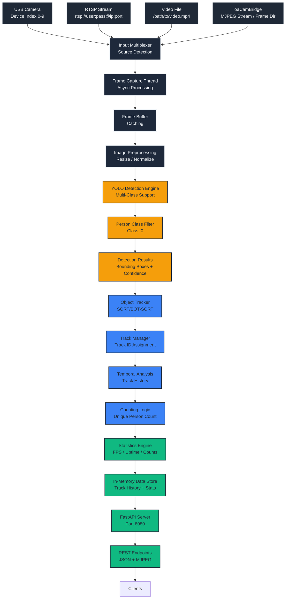
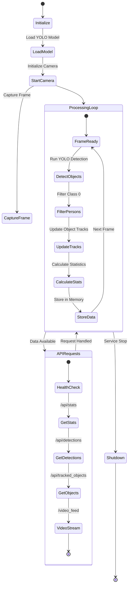
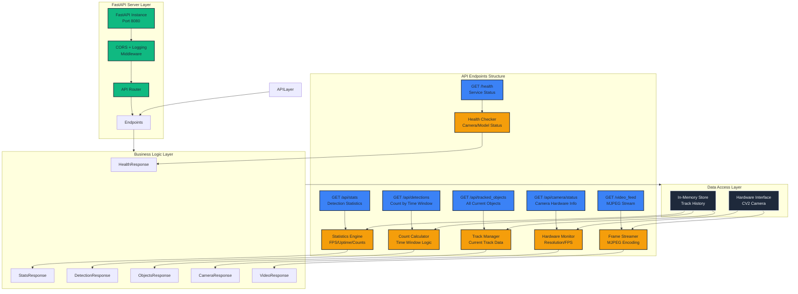
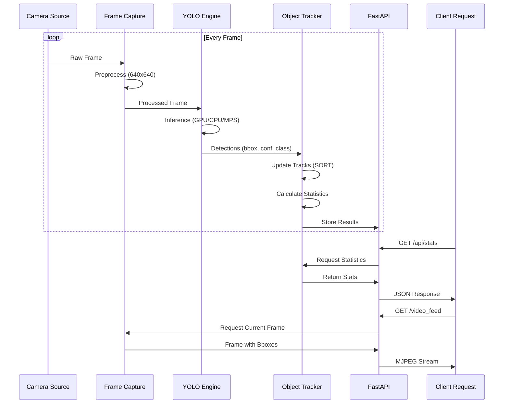
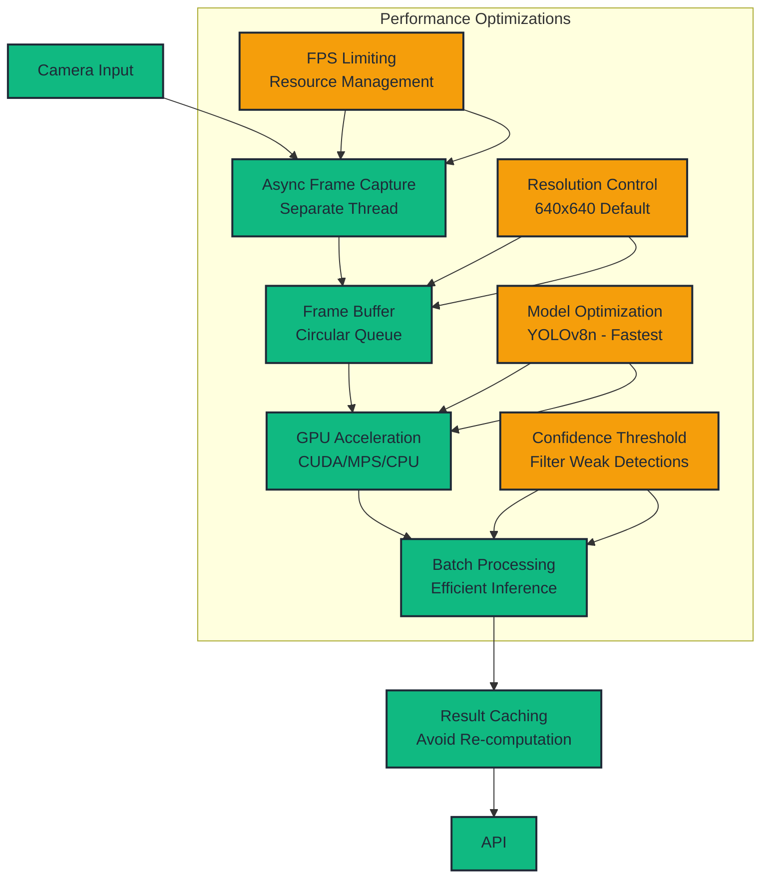
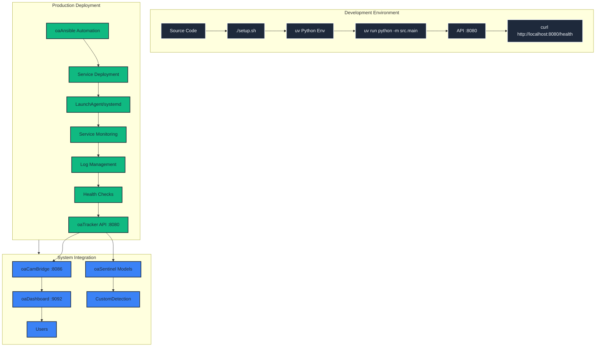
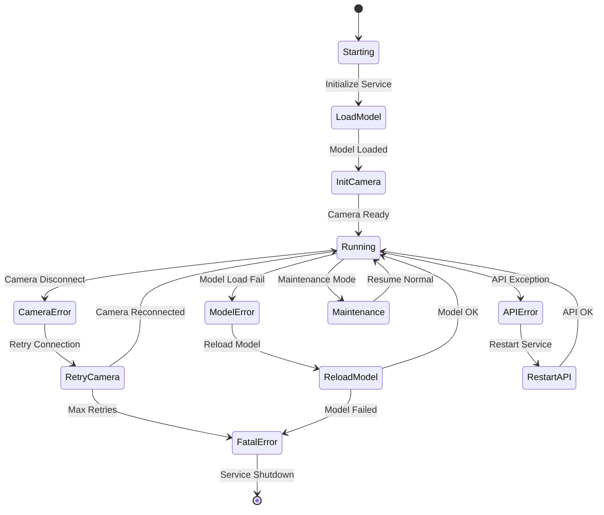

# oaTracker Workflow Diagram

## Overview

Real-time human detection and tracking service using YOLO models with multi-source input handling and comprehensive API endpoints for macOS and Ubuntu deployment.

## ML Pipeline Architecture

## Object Tracking Workflow

## Multi-Source Input Handling

```mermaid
flowchart LR
    subgraph InputSources [Input Sources]
        USB0[USB Camera 0\n/dev/video0]
        USB1[USB Camera 1\n/dev/video1]
        RTSP1[RTSP Stream 1\nrtsp://ip:8554/stream1]
        RTSP2[RTSP Stream 2\nrtsp://ip:8554/stream2]
        VIDEO[Video File\n/video.mp4]
        CAM_HTTP[oaCamBridge HTTP\nhttp://localhost:8086/stream]
        CAM_DIR[oaCamBridge Frames\n/tmp/webcam/*.jpg]
    end

    subgraph InputProcessingLayer [Input Processing Layer]
        Config[Config Parser\nconfig.yaml] --> SourceRouter
        SourceRouter[Source Router\nAuto-Detection] --> FormatAdapter
        FormatAdapter[Format Adapter\nCV2/URL/File] --> Validation
        Validation[Input Validation\nResolution/FPS] --> FrameCapture
    end

    subgraph FrameProcessingPipeline [Frame Processing Pipeline]
        FrameCapture[Frame Capture\nAsync Threading] --> Preprocess
        Preprocess[Preprocessing\nResize 640x640] --> Normalize
        Normalize[Normalization\n0-1 Range] --> BatchReady
        BatchReady[Batch Ready\nInference Queue] --> YOLO
    end

    InputSources --> InputProcessing
    InputProcessing --> FramePipeline

    classDef source fill:#1f2937,stroke:#f8fafc,stroke-width:2px,color:#f8fafc
    classDef processing fill:#1e293b,stroke:#f1f5f9,stroke-width:2px,color:#f1f5f9
    classDef pipeline fill:#f59e0b,stroke:#1f2937,stroke-width:2px,color:#1f2937

    class USB0,USB1,RTSP1,RTSP2,VIDEO,CAM_HTTP,CAM_DIR source
    class Config,SourceRouter,FormatAdapter,Validation processing
    class FrameCapture,Preprocess,Normalize,BatchReady,YOLO pipeline
```

## API Endpoint Architecture

## Real-Time Processing Flow

## Performance Optimization Flow

## Service Deployment Architecture

## Error Handling and Recovery

## Key Performance Indicators

```mermaid
flowchart LR
    subgraph Metrics [Performance Metrics]
        FPS[Frames Per Second\nTarget: 25-30 FPS]
        Latency[Detection Latency\nTarget: <100ms]
        Memory[Memory Usage\nTarget: <2GB]
        CPU[CPU Usage\nTarget: <50%]
        Accuracy[Detection Accuracy\nTarget: >95%]
        Uptime[Service Uptime\nTarget: 99.9%]
    end

    subgraph Monitoring [Monitoring & Alerting]
        HealthChecks[Health Endpoints] --> Alerts
        Alerts[Alert System] --> Dashboard
        Dashboard[Monitoring Dashboard] --> Logs
        Logs[Log Aggregation] --> Analysis
        Analysis[Performance Analysis] --> Optimization
        Optimization[Auto-Optimization] --> Metrics
    end

    Metrics --> Monitoring

    classDef metric fill:#f59e0b,stroke:#1f2937,stroke-width:2px,color:#1f2937
    classDef monitor fill:#10b981,stroke:#1f2937,stroke-width:2px,color:#1f2937

    class FPS,Latency,Memory,CPU,Accuracy,Uptime metric
    class HealthChecks,Alerts,Dashboard,Logs,Analysis,Optimization monitor
```

